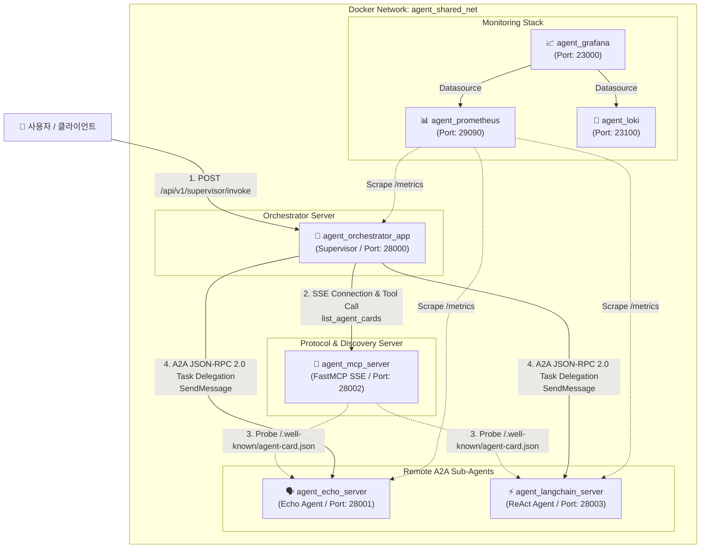

# Agent Ecosystem (Agent Orchestrator)

다중 에이전트 오케스트레이션 시스템으로, **Model Context Protocol (MCP) 기반 동적 탐색(Dynamic Discovery)**과 **Google ADK A2A(Agent-to-Agent) JSON-RPC 2.0 프로토콜**을 적용하여 여러 독립 에이전트와 모니터링 시스템을 중앙 조율(Supervisor)하는 프로젝트입니다.

> 📚 **모듈별 및 기술 상세 문서는 [docs/README.md](docs/README.md)에서 확인하실 수 있습니다.**

---

## 🏛️ 시스템 아키텍처 (Mermaid Diagram)

모든 서비스는 독립된 Docker 컨테이너로 동작하며, `agent_shared_net` 공유 네트워크를 통해 동적으로 서로를 탐색하고 통신합니다.



---

## 📂 디렉토리 및 폴더 구조 (Project Structure)

```text
agent_test/
├── 📚 docs/                    # 모듈별 통합 기술 문서 디렉토리
│   ├── app/                    # Orchestrator Server 상세 문서
│   ├── agent_server/           # Sub-Agents Server 상세 문서
│   ├── mcp_server/             # FastMCP Discovery Server 상세 문서
│   ├── shared_core/            # Shared Core Library 상세 문서
│   ├── monitoring/             # Monitoring Stack 상세 문서
│   ├── scripts/                # Operations Shell Scripts 상세 문서
│   ├── references/             # LangGraph 기술 참조 문서
│   ├── harness/                # 테스트 & 평가 하네스 엔지니어링 가이드
│   ├── architecture.md         # 전체 아키텍처 & 프로토콜 흐름도
│   └── README.md               # 문서 통합 목차 가이드
│
├── 🤖 app/                     # Orchestrator (Supervisor Client Server)
│   ├── agents/                 # Supervisor 에이전트 및 Base 인터페이스 정의
│   │   ├── base.py             # 에이전트 공통 추상 클래스 (BaseAgent)
│   │   ├── factory.py          # Supervisor 에이전트 생성 팩토리 (AgentFactory)
│   │   ├── supervisor.py       # A2A Task 위임 & MCP 동적 등록 관리자
│   │   └── prompts/            # Supervisor 전역 프롬프트 (supervisor.yml)
│   ├── api/                    # FastAPI 외부 노출 REST API 엔드포인트
│   │   └── v1/orchestrator/   # /api/v1/supervisor/invoke 등 오케스트레이터 라우터
│   ├── core/                   # 앱 전역 설정, LLM 레지스트리, MCP 클라이언트
│   │   ├── config.py           # Settings 관리 (Pydantic BaseSettings)
│   │   ├── lifespan.py         # FastAPI 애플리케이션 시작/종료 수명주기
│   │   ├── llm.py              # Multi-provider LLM Registry (OpenAI/Anthropic/Google)
│   │   └── mcp_client.py       # MCP Server 연동 & Agent Card 동적 수집 유틸리티
│   ├── dependencies/           # FastAPI 의존성 주입 (get_supervisor 등)
│   ├── tests/                  # Supervisor 및 Health API 유닛 테스트 (pytest)
│   ├── application.py          # FastAPI 앱 생성 팩토리 (create_app)
│   └── main.py                 # Uvicorn 진입점 서버 (Port: 28000)
│
├── 🗣️ agent_server/            # Remote Sub-Agents Server (원격 서브 에이전트)
│   ├── agents/                 # 에이전트 모듈 정의
│   │   ├── echo_agent.py       # Echo 메시지 수신/반환 테스트 에이전트 (Port: 28001)
│   │   ├── langchain_agent.py  # LangChain ReAct 지능형 서브 에이전트 (Port: 28003)
│   │   └── prompts/            # 서브 에이전트 프롬프트 (echo.yml, langchain.yml)
│   └── core/                   # 서브 에이전트 전역 LLM 레지스트리 및 설정
│
├── 🔌 mcp_server/              # Model Context Protocol (FastMCP Server)
│   ├── tools/                  # MCP 도구 정의
│   │   └── agent_card.py       # list_agent_cards (에이전트 동적 탐색 도구)
│   └── server.py               # FastMCP SSE 전송 서버 진입점 (Port: 28002)
│
├── 📦 shared_core/             # 공통 공유 라이브러리 (Shared Core Package)
│   └── src/shared_core/
│       ├── logger.py           # UTF-8 지원 Structlog 렌더러 및 로깅 관리자
│       └── prompt.py           # YAML 프롬프트 로더 유틸리티
│
├── 📊 monitoring/              # 관찰 가능성 모니터링 스택 (Monitoring Stack)
│   ├── grafana/                # Grafana 대시보드 및 데이터소스 프로비저닝 (Port: 23000)
│   ├── prometheus.yml          # Prometheus 메트릭 수집 주기 및 타겟 설정 (Port: 29090)
│   ├── promtail-config.yaml    # Docker 컨테이너 로그 수집 설정
│   └── docker-compose.yml      # Loki, Promtail, Prometheus, Grafana, cAdvisor 컴포즈
│
├── 📜 scripts/                 # 각 모듈별 제어 쉘 스크립트
│   ├── app/                    # Orchestrator 실행/종료 스크립트
│   ├── agent_server/           # Remote Agents 실행/종료 스크립트
│   ├── mcp_server/             # MCP Server 실행/종료 스크립트
│   └── monitoring/             # Monitoring Stack 실행/종료 스크립트
│
├── 🚀 start.sh                 # 전체 서비스 원클릭 시작 스크립트
└── 🛑 stop.sh                  # 전체 서비스 원클릭 종료 스크립트
```

---

## ⚙️ 주요 기능 및 특징

1. **MCP 기반 동적 에이전트 탐색 (Dynamic Discovery)**
   - 정적 `.env` 설정 없이, Supervisor 실행 시 MCP Server(`agent_mcp_server`)의 `list_agent_cards` 도구를 호출하여 서브 에이전트들의 접속 URL 및 능력(Agent Card)을 동적으로 등록합니다.
2. **Google ADK A2A JSON-RPC 2.0 호환**
   - 표준화된 A2A 통신 메커니즘을 적용하여 서브 에이전트(`echo`, `langchain`) 간의 메시지 전달 및 결과 수집을 수행합니다.
3. **통합 모니터링 & 구조화 로그**
   - Prometheus + Grafana 메트릭 수집 및 Loki + Promtail을 통한 실시간 UTF-8 구조화 로그 수집(`task.*`, `artifact.*`)을 제공합니다.

---

## 🚀 시작하기

### 1. 요구 사항
- Docker & Docker Compose
- Bash Shell

### 2. 환경 설정
`.env.example` 파일을 복사하여 환경 변수 파일(`.env`)을 생성합니다.
```bash
cp .env.example .env
```
*(선택 사항: `.env`에 `OPENAI_API_KEY`, `ANTHROPIC_API_KEY`, `GOOGLE_API_KEY`를 설정할 수 있습니다. 키가 없을 경우 자동으로 Mock LLM 모드로 작동합니다.)*

### 3. 서비스 실행
제공된 통합 관리 스크립트를 사용하여 모든 컨테이너 인프라를 한 번에 생성 및 시작합니다.
```bash
./start.sh
```

---

## 📍 서비스 엔드포인트 (Endpoints)

| 서비스 명 | 컨테이너 이름 | 포트 | 용도 / 설명 |
| :--- | :--- | :--- | :--- |
| **Orchestrator App** | `agent_orchestrator_app` | `28000` | Supervisor 에이전트 API ([http://localhost:28000](http://localhost:28000)) |
| **Echo Sub-Agent** | `agent_echo_server` | `28001` | Echo 테스트 서브 에이전트 ([http://localhost:28001](http://localhost:28001)) |
| **MCP Server** | `agent_mcp_server` | `28002` | MCP SSE 서버 및 에이전트 탐색 도구 ([http://localhost:28002](http://localhost:28002)) |
| **LangChain Sub-Agent** | `agent_langchain_server` | `28003` | LangChain ReAct 서브 에이전트 ([http://localhost:28003](http://localhost:28003)) |
| **Grafana Dashboard** | `agent_grafana` | `23000` | 모니터링 대시보드 ([http://localhost:23000](http://localhost:23000), `admin`/`admin`) |
| **Prometheus** | `agent_prometheus` | `29090` | 메트릭 수집 서버 ([http://localhost:29090](http://localhost:29090)) |

---

## 💡 API 사용 예시 (curl)

### Supervisor 에이전트 호출 (자동 탐색 및 서브 에이전트 위임)
```bash
curl -X POST http://localhost:28000/api/v1/supervisor/invoke \
  -H "Content-Type: application/json" \
  -d '{"message": "echo 에이전트에게 인사하고, 서울 날씨 알아봐줘"}'
```

---

## 🛑 전체 서비스 종료

```bash
./stop.sh
```
> **참고**: 스크립트를 통해 서비스를 종료하더라도 Docker 데이터 볼륨은 유지됩니다.
