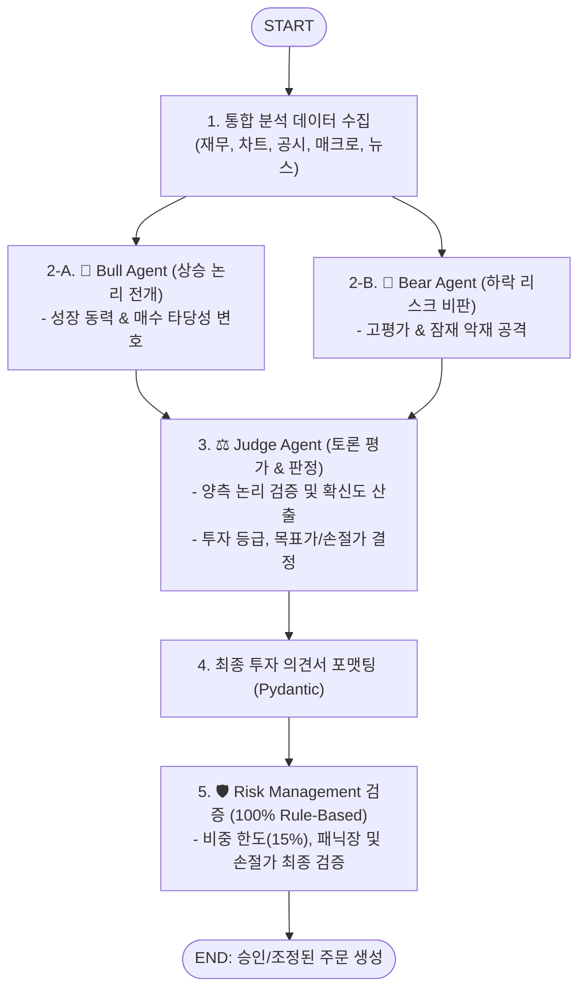

# 🐂🐻 Bull vs Bear Debate Sub-Agent (`bull_bear_debate_agent`)

본 문서는 상승론자(Bull)와 하락론자(Bear)의 다각적 대립 토론을 거쳐 판사(Judge)가 객관적인 최종 투자 판단을 도출하는 **Bull vs Bear Debate Sub-Agent**의 아키텍처 및 구현 가이드입니다.

---

## 1. 개요

`bull_bear_debate_agent`는 단일 LLM 분석에서 발생할 수 있는 편향(Confirmation Bias)과 환각을 극복하기 위해 설계된 **판단 및 의사결정(Judgment & Decision) 전문 서브 에이전트**입니다.
`fundamental_agent`, `technical_agent`, `dart_disclosure_agent`, `macro_sector_agent` 등으로부터 수집된 모든 분석 데이터를 입력받아:
1. **Bull Agent (상승론자)**가 성장 모멘텀과 매수 근거를 극대화하여 주장하고,
2. **Bear Agent (하락론자)**가 고평가 리스크, 경쟁 위협, 잠재 악재를 공격적으로 비판하며,
3. **Judge Agent (판사/조정자)**가 양측의 논리성과 근거의 신뢰성을 엄밀히 채점하여 최종 투자 의견(`STRONG_BUY`, `BUY`, `HOLD`, `SELL`, `STRONG_SELL`) 및 적정 목표가/손절가를 산출합니다.

Google ADK의 `to_a2a` 유틸리티를 적용하여 표준 A2A JSON-RPC 2.0 서버로 동작합니다.

---

## 2. 주요 기능 및 특징

- **다자간 토론형 Multi-Agent 아키텍처 (LangGraph Multi-Turn Graph)**:
  - `Bull Node` ➡️ `Bear Node` ➡️ `Judge Node` 순차 또는 라운드(Multi-Round) 토론 워크플로우.
- **Bull Agent (상승론자)**:
  - 밸류에이션 저평가, 실적 서프라이즈, 기술적 반등 시그널, 산업 성장성을 바탕으로 적극 매수 논리 전개.
- **Bear Agent (하락론자)**:
  - 밸류에이션 부담, 오버행 리스크, 경기 침체 우려, 실적 피크아웃(Peak-out) 가능성을 근거로 하락 리스크 부각.
- **Judge Agent (판사)**:
  - 양측의 주장 강도, 데이터 기반 설득력, 시장 매크로 부합도를 평가하여 점수표(Scorecard) 및 최종 투자 등급 생성.
- **Pydantic Structured Output**:
  - `InvestmentDecisionSchema` (투자의견, 확신도 1~100%, 목표가, 손절가, 핵심 불/베어 요약) 구조화 반환.

---

## 3. LangGraph 워크플로우 구조



---

## 4. 기술 스택 및 요구사항

- **Language & Framework**: Python 3.12, FastAPI / Starlette
- **Agent Framework**: LangGraph (Multi-Agent StateGraph), Google ADK (`google-adk`), Pydantic
- **포트 및 서비스명**:
  - **Port**: `28008`
  - **Docker Service Name**: `agent_bull_bear_debate_server`

---

## 5. 실행 및 테스트

### 5.1. 에이전트 독립 실행
```bash
uvicorn agent_server.agents.bull_bear_debate_agent:app --host 0.0.0.0 --port 28008
```

### 5.2. Agent Card 확인
```bash
curl -s http://localhost:28008/.well-known/agent-card.json | jq .
```
