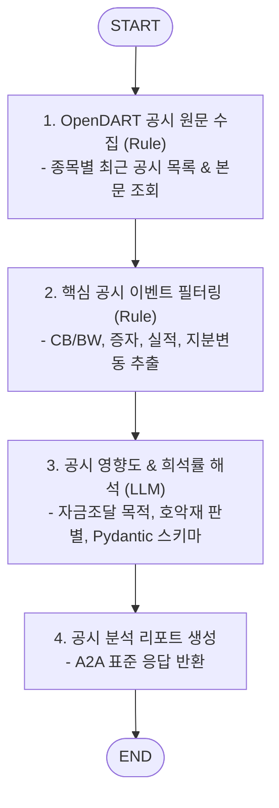

# 📑 DART Disclosure Sub-Agent (`dart_disclosure_agent`)

본 문서는 금융감독원 전자공시시스템(DART/OpenDART)의 기업 공시 데이터를 실시간 모니터링 및 분석하는 **DART Disclosure Sub-Agent**의 아키텍처 및 구현 가이드입니다.

---

## 1. 개요

`dart_disclosure_agent`는 상장 기업의 주요 공시(유상증자, 무상증자, 전환사채(CB)/신주인수권부사채(BW) 발행, 최대주주 변경, 자사주 매입/소각, 지분 취득 등)를 실시간 수집하고 기업 가치에 미치는 영향을 즉시 평가하는 전문 서브 에이전트입니다.
LLM과 OpenDART API를 연동하여 복잡한 법적/회계적 공시 본문을 해석하고, 호재/악재 분류 및 오버행(잠재적 매도 물량) 리스크 점수를 산출합니다.
Google ADK의 `to_a2a` 유틸리티를 적용하여 표준 A2A JSON-RPC 2.0 서버로 동작합니다.

---

## 2. 주요 기능 및 특징

- **OpenDART 실시간 공시 피드 수집**:
  - 주요 공시 유형: 정기공시(사업/분기보고서), 주요사항보고서(증자/감자/합병), 지분공시(5% 대량보유), 거래소 수시공시.
- **공시 텍스트 노이즈 정제 및 핵심 요약 (LLM)**:
  - 수십 페이지 분량의 공시 원문 중 발행가액, 전환가액, 조달 목적, 대상자 등 핵심 조건 자동 추출.
- **오버행(Overhang) 및 희석 리스크 정량 평가**:
  - CB/BW 발행 시 총 주식수 대비 전환 가능 주식수 비율(희석률) 및 리픽싱(전환가액 조정) 조건 분석.
- **공시 영향도 등급 분류**:
  - `POSITIVE_HIGH`, `POSITIVE_MODERATE`, `NEUTRAL`, `NEGATIVE_MODERATE`, `NEGATIVE_HIGH` 5단계 분류.

---

## 3. LangGraph 워크플로우 구조



---

## 4. 기술 스택 및 요구사항

- **Language & Framework**: Python 3.12, FastAPI / Starlette
- **Data Source**: OpenDART API (`opendartreader` 또는 공식 API)
- **Agent Framework**: LangGraph, Google ADK (`google-adk`), Pydantic
- **포트 및 서비스명**:
  - **Port**: `28006`
  - **Docker Service Name**: `agent_dart_disclosure_server`

---

## 5. 실행 및 테스트

### 5.1. 에이전트 독립 실행
```bash
uvicorn agent_server.agents.dart_disclosure_agent:app --host 0.0.0.0 --port 28006
```

### 5.2. Agent Card 확인
```bash
curl -s http://localhost:28006/.well-known/agent-card.json | jq .
```
