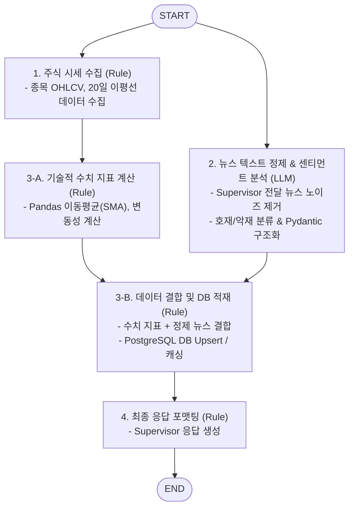

# ⚙️ Data Processing Sub-Agent (`data_processing_agent`)

본 문서는 LangGraph 기반 주식 데이터 하이브리드 파이프라인(`시세 수집: Rule ➡️ 뉴스 정제: LLM ➡️ 지표 가공 & DB 적재: Rule`) 및 PostgreSQL DB 연동을 담당하는 **Data Processing Sub-Agent**의 아키텍처 및 구현 가이드입니다.

---

## 1. 개요

`data_processing_agent`는 금융 API(시세 OHLCV)를 수집하고, Supervisor로부터 전달받은 최신 웹/뉴스 텍스트를 LLM을 통해 정제하며, Pandas 수치 지표 연산 및 PostgreSQL DB 영속화를 수행하는 데이터 처리 전문 서브 에이전트입니다.
LangGraph의 `StateGraph` 구조를 사용하여 결정론적 연산(Rule)과 언어 모델 정제(LLM)를 효율적으로 결합하며, Google ADK의 **`to_a2a` 변환 유틸리티**를 사용하여 A2A 호환 서버로 동작합니다.

---

## 2. 주요 기능 및 특징

- **`수집(Rule) ➡️ 정제(LLM) ➡️ 가공 및 적재(Rule)` 하이브리드 파이프라인**:
  - **1. 시세 수집 (Rule)**: 금융 API(OHLCV)를 호출하여 정형 시세 데이터 수집.
  - **2. 텍스트 정제 (LLM)**: Supervisor가 전달한 비정형 뉴스 텍스트 노이즈 제거, 핵심 요약 및 시장 센티먼트 추출 (`Pydantic Structured Output` 스키마 강제).
  - **3. 지표 가공 (Rule)**: Pandas/Numpy 이동평균(SMA), 변동성 등 수치 지표 연산(환각 방지).
  - **4. DB 영속화 (Rule)**: 수치 지표 + 정제 분석 데이터를 결합하여 PostgreSQL DB에 적재(Upsert).
  - **5. 포맷팅 (Rule)**: 표준화된 리포트 메시지 생성 및 반환.
- **PostgreSQL 비동기 DB 연동**:
  - SQLAlchemy / asyncpg 커넥션 풀을 활용하여 일봉/분봉 시세 및 취합 지표 영속화.
- **Google ADK `to_a2a` 변환 래퍼**:
  - `from google.adk.a2a.utils.agent_to_a2a import to_a2a`를 활용해 LangGraphAgent 인스턴스를 Starlette/FastAPI 웹 앱으로 변환.
- **Observability**:
  - Prometheus Instrumentator 메트릭 스크랩 지원 (`/metrics`).

---

## 3. LangGraph StateGraph 파이프라인 구조



### 3.1. `shared_core.BaseNode` 기반 노드 구현 예시

```python
from typing import Dict, Any
from langgraph.graph import StateGraph, START, END
from google.adk.a2a.utils.agent_to_a2a import to_a2a
from google.adk.agents.langgraph_agent import LangGraphAgent
from shared_core import BaseNode

# 1. BaseNode를 상속받은 노드 정의 (자동 로깅 & 의존성 주입)
class IndicatorNode(BaseNode[StockProcessingState, Dict[str, Any]]):
    async def process(self, state: StockProcessingState) -> Dict[str, Any]:
        prices = state["raw_price_data"]["prices_20d"]
        sma_20 = sum(prices) / len(prices)
        return {"technical_metrics": {"sma_20": sma_20}}

# 2. 노드 인스턴스 생성 및 StateGraph 등록
calc_node = IndicatorNode(name="calc_indicators")

builder = StateGraph(StockProcessingState)
builder.add_node("calc_indicators", calc_node)  # __call__이 자동 바인딩됨
```

---

## 4. 기술 스택 및 요구사항

- **Language & Framework**: Python 3.12, FastAPI / Starlette
- **Agent Framework**: LangGraph, Google ADK (`google-adk`), Pydantic
- **Common Library**: `shared_core` (`BaseNode`, `logger`, `prompt`)
- **Database**: PostgreSQL (SQLAlchemy AsyncSession, asyncpg)
- **A2A Adapter**: `google.adk.a2a.utils.agent_to_a2a.to_a2a`
- **포트 및 서비스명**:
  - **Port**: `28001`
  - **Docker Service Name**: `agent_data_processing_server`

---

## 5. 실행 및 테스트

### 5.1. 에이전트 독립 실행
```bash
uvicorn agent_server.agents.data_processing_agent:app --host 0.0.0.0 --port 28001
```

### 5.2. Agent Card 확인
```bash
curl -s http://localhost:28001/.well-known/agent-card.json | jq .
```
