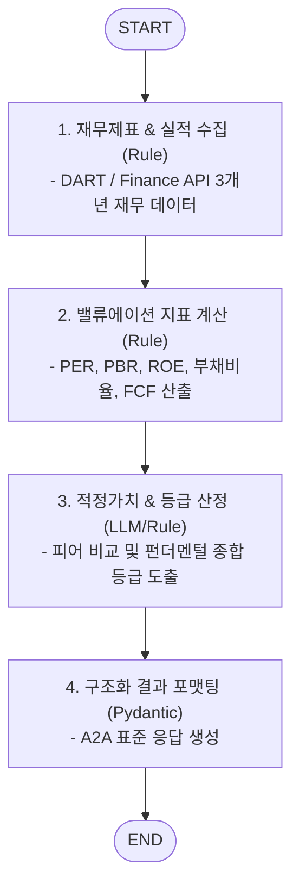

# 📊 Fundamental Analysis Sub-Agent (`fundamental_agent`)

본 문서는 기업 재무제표, 밸류에이션 지표 및 실적 데이터를 정량적으로 분석하는 **Fundamental Analysis Sub-Agent**의 아키텍처 및 구현 가이드입니다.

---

## 1. 개요

`fundamental_agent`는 상장 기업의 재무 건전성, 수익성, 성장성 및 밸류에이션(가치 평가)을 종합 분석하는 전문 서브 에이전트입니다.
DART 전자공시 및 금융 데이터 API로부터 손익계산서, 대차대조표, 현금흐름표를 연동하여 PER, PBR, ROE, 부채비율, 잉여현금흐름(FCF) 등의 지표를 산출하고, 적정 주가 모델링 및 재무 건전성 등급을 도출합니다.
Google ADK의 `to_a2a` 유틸리티를 적용하여 표준 A2A JSON-RPC 2.0 및 HTTP 프로토콜 엔드포인트로 외부에 노출됩니다.

---

## 2. 주요 기능 및 특징

- **재무 3표 정량 분석**:
  - 손익계산서 (매출액, 영업이익, 당기순이익, 영업이익률)
  - 대차대조표 (자산, 부채, 자본, 부채비율, 유동비율)
  - 현금흐름표 (영업현금흐름, 투자현금흐름, 잉여현금흐름 FCF)
- **밸류에이션 및 적정 주가 모델링**:
  - 상대가치 평가: 업종 평균 및 동종 피어(Peer) 그룹 대비 PER / PBR / EV/EBITDA 비교.
  - 수익가치 평가: ROE-PBR 매트릭스 및 RIM(잔여이익모델) 기반 적정 밸류 산출.
- **컨센서스(시장 추정치) 대비 실적 분석**:
  - 분기별 어닝 서프라이즈(Earnings Surprise) / 어닝 쇼크 여부 자동 감지.
- **Pydantic Structured Output**:
  - 정량 지표와 재무 등급(S~D)을 구조화된 JSON 규격으로 반환.
- **Google ADK `to_a2a` 표준 호환**:
  - `/.well-known/agent-card.json` 자동 제공 및 A2A JSON-RPC 2.0 통신 지원.

---

## 3. LangGraph 워크플로우 구조



---

## 4. 기술 스택 및 요구사항

- **Language & Framework**: Python 3.12, FastAPI / Starlette
- **Agent Framework**: LangGraph, Google ADK (`google-adk`), Pydantic
- **포트 및 서비스명**:
  - **Port**: `28004`
  - **Docker Service Name**: `agent_fundamental_server`

---

## 5. 실행 및 테스트

### 5.1. 에이전트 독립 실행
```bash
uvicorn agent_server.agents.fundamental_agent:app --host 0.0.0.0 --port 28004
```

### 5.2. Agent Card 확인
```bash
curl -s http://localhost:28004/.well-known/agent-card.json | jq .
```
