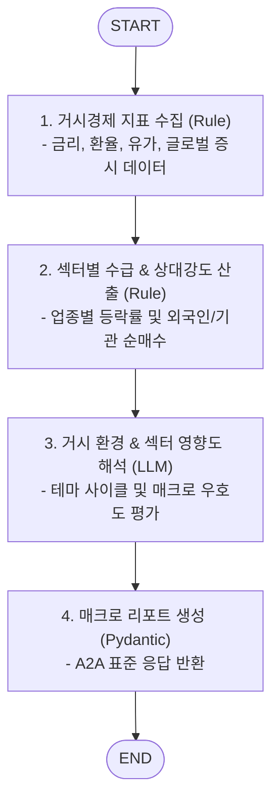

# 🌐 Macroeconomic & Sector Sub-Agent (`macro_sector_agent`)

본 문서는 거시경제 지표, 글로벌 증시 동향 및 산업 섹터 트렌드를 분석하는 **Macroeconomic & Sector Sub-Agent**의 아키텍처 및 구현 가이드입니다.

---

## 1. 개요

`macro_sector_agent`는 개별 종목을 둘러싼 거시경제(Macro) 환경과 속한 산업 섹터(Sector)의 로테이션 흐름을 종합 평가하는 전문 서브 에이전트입니다.
미국 연준(Fed) 및 한국은행 기준금리, 국채 금리(10년물/2년물 스프레드), 환율(달러/원), WTI 유가, 미국 나스닥/S&P500 지수 추이 및 반도체/2차전지/바이오 등 주요 섹터별 자금 유입 동향을 분석하여 거시 시장 우호도 점수를 도출합니다.
Google ADK의 `to_a2a` 유틸리티를 적용하여 표준 A2A JSON-RPC 2.0 서버로 동작합니다.

---

## 2. 주요 기능 및 특징

- **글로벌 거시경제 지표 트래킹**:
  - 금리 & 통화정책: 한/미 기준금리, 미 국채 10년물 금리 추이.
  - 환율 & 원자재: 달러 인덱스(DXY), USD/KRW 환율, WTI 유가, 필라델피아 반도체 지수(SOX).
  - 글로벌 증시: S&P 500, 나스닥 100 마감 동향 및 야간 선물 지수.
- **섹터 로테이션 및 테마 자금 흐름 분석**:
  - 코스피/코스닥 내 섹터별(반도체, IT, 헬스케어, 자동차, 금융 등) 일간/주간 상대 강도(RS) 계산.
  - 외국인/기관의 섹터별 자금 순유입/유출 추적.
- **시장 환경 우호도 점수화 (Macro Score)**:
  - 개별 종목이 속한 섹터에 거시 환경이 미치는 영향(우호/중립/비우호)을 1~100점 스코어로 제공.

---

## 3. LangGraph 워크플로우 구조



---

## 4. 기술 스택 및 요구사항

- **Language & Framework**: Python 3.12, FastAPI / Starlette
- **Data Source**: Finance API (FRED, Yahoo Finance, ECOS 등)
- **Agent Framework**: LangGraph, Google ADK (`google-adk`), Pydantic
- **포트 및 서비스명**:
  - **Port**: `28007`
  - **Docker Service Name**: `agent_macro_sector_server`

---

## 5. 실행 및 테스트

### 5.1. 에이전트 독립 실행
```bash
uvicorn agent_server.agents.macro_sector_agent:app --host 0.0.0.0 --port 28007
```

### 5.2. Agent Card 확인
```bash
curl -s http://localhost:28007/.well-known/agent-card.json | jq .
```
