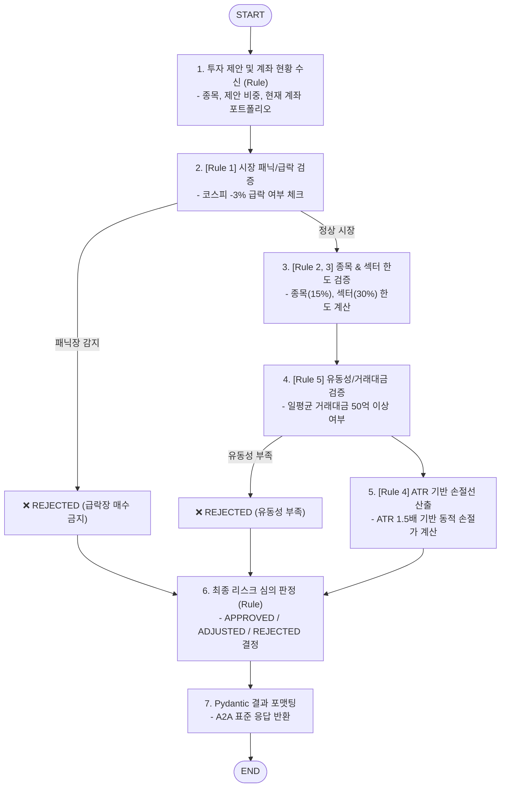

# 🛡️ Risk Management Sub-Agent (`risk_management_agent`)

본 문서는 변동성 한도, 손절 라인, 포트폴리오 비중 및 시장 급락 위험을 **100% Rule-Based(결정론적 수식 및 비즈니스 규칙)**로 엄격하게 검증하는 **Risk Management Sub-Agent**의 아키텍처 및 구현 가이드입니다.

---

## 1. 개요 & Rule-Based 검증 철학

`risk_management_agent`는 투자 판단 에이전트(`bull_bear_debate_agent` 등)가 "매수" 결정을 내렸더라도, **계좌 자금 관리 원칙과 리스크 한도를 최종 심사하는 게이트키퍼(Gatekeeper) 서브 에이전트**입니다.

> [!IMPORTANT]
> **왜 검증(Validation)은 100% Rule-Based이어야 하는가?**
> 1. **환각(Hallucination) 원천 차단**: 금융 리스크 관리에서 잘못된 승인(False Positive)은 직접적인 금전적 손실로 직결되므로, LLM의 비결정론적(Probabilistic) 판단을 배제합니다.
> 2. **100% 재현성과 투명성(Explainability)**: "왜 매수가 거부/축소되었는가?"에 대해 명확한 수식과 조건식(예: `현재 비중(22%) + 신규(15%) > 한도(30%)`)으로 사유를 증명합니다.
> 3. **초고속 실행 및 비용 0원**: 마이크로초 단위의 순수 파이썬 수식 연산으로 LLM 토큰 비용 없이 즉각적인 제동을 겁니다.

Google ADK의 `to_a2a` 유틸리티를 적용하여 표준 A2A JSON-RPC 2.0 서버로 동작합니다.

---

## 2. 4대 핵심 Rule-Based 검증 규칙 (Verification Rules)

| 규칙 명 | 검증 대상 | Rule 판정 기준 | 위반 시 조치 |
| :--- | :--- | :--- | :--- |
| **Rule 1. 패닉장 필터**<br/>(`MarketPanicFilter`) | 시장 전체 급락 | • 코스피/코스닥 당일 **-3.0% 초과 급락**<br/>• 변동성 지수(VKOSPI) 급등 시 | **`REJECTED` (전면 매수 차단)** |
| **Rule 2. 종목 비중 한도**<br/>(`PositionLimitRule`) | 단일 종목 집중도 | • 단일 종목 총자산 대비 **최대 15%** 초과 | **`ADJUSTED` (15% 이내로 수량 자동 삭감)** |
| **Rule 3. 섹터 비중 한도**<br/>(`SectorExposureRule`) | 산업군 쏠림 현상 | • 동일 섹터 총자산 대비 **최대 30%** 초과 | **`ADJUSTED` (초과분 수량 삭감)** |
| **Rule 4. 동적 손절선**<br/>(`StopLossRule`) | 변동성 기반 손절가 | • 수식: `진입가 - (ATR_14 * 1.5)`<br/>• 최대 허용 손실폭: -5.0% 이내 | **필수 손절가(`stop_loss_price`) 자동 산정** |
| **Rule 5. 유동성 필터**<br/>(`LiquidityFilter`) | 거래대금 부족 | • 최근 20일 일평균 거래대금 **50억 원 미만** | **`REJECTED` (슬리피지 방지)** |

---

## 3. LangGraph Rule-Based 워크플로우 구조



---

## 4. `shared_core.BaseNode` 기반 Rule-Based 노드 구현 예시

```python
from typing import TypedDict, Optional, Dict, Any, List
from pydantic import BaseModel, Field
from langgraph.graph import StateGraph, START, END
from shared_core import BaseNode

# 1. 리스크 검증 상태(State) 정의
class RiskState(TypedDict):
    ticker: str
    proposed_weight: float       # 제안된 매수 비중 (예: 0.15 = 15%)
    current_portfolio: Dict[str, Any]
    market_status: Dict[str, Any]
    verdict: str                 # APPROVED, ADJUSTED, REJECTED
    approved_weight: float       # 최종 승인된 비중
    stop_loss_price: float       # 산정된 손절가
    rejection_reasons: List[str]

# [Rule Node 1] 시장 패닉 검증 노드 (100% Rule-based)
class MarketPanicRuleNode(BaseNode[RiskState, Dict[str, Any]]):
    async def process(self, state: RiskState) -> Dict[str, Any]:
        market = state.get("market_status", {})
        kospi_change = market.get("kospi_change_rate", 0.0)
        
        # Rule: 코스피 -3% 이상 급락 시 매수 전면 반려
        if kospi_change <= -3.0:
            return {
                "verdict": "REJECTED",
                "approved_weight": 0.0,
                "rejection_reasons": [f"시장 패닉장 감지 (코스피 당일 등락률: {kospi_change:.2f}%)"]
            }
        return {}

# [Rule Node 2] 포트폴리오 비중 한도 검증 노드 (100% Rule-based)
class PositionLimitRuleNode(BaseNode[RiskState, Dict[str, Any]]):
    MAX_STOCK_WEIGHT = 0.15   # 단일 종목 최대 15%
    MAX_SECTOR_WEIGHT = 0.30  # 단일 섹터 최대 30%

    async def process(self, state: RiskState) -> Dict[str, Any]:
        if state.get("verdict") == "REJECTED":
            return {}

        proposed = state["proposed_weight"]
        portfolio = state.get("current_portfolio", {})
        current_sector_weight = portfolio.get("sector_weight", 0.0)

        # 1. 단일 종목 한도 초과 체크
        allowed_weight = min(proposed, self.MAX_STOCK_WEIGHT)
        
        # 2. 섹터 한도 초과 체크
        if current_sector_weight + allowed_weight > self.MAX_SECTOR_WEIGHT:
            allowed_weight = max(0.0, self.MAX_SECTOR_WEIGHT - current_sector_weight)

        verdict = "APPROVED" if allowed_weight == proposed else "ADJUSTED"
        reasons = []
        if allowed_weight < proposed:
            reasons.append(f"비중 한도(종목 15%, 섹터 30%) 초과로 제안 비중({proposed*100:.1f}%)을 {allowed_weight*100:.1f}%로 조정")

        return {
            "verdict": verdict,
            "approved_weight": allowed_weight,
            "rejection_reasons": reasons
        }

# [Rule Node 3] ATR 기반 손절가 산출 노드 (100% Rule-based)
class StopLossRuleNode(BaseNode[RiskState, Dict[str, Any]]):
    async def process(self, state: RiskState) -> Dict[str, Any]:
        current_price = state.get("market_status", {}).get("current_price", 75000)
        atr_14 = state.get("market_status", {}).get("atr_14", 1500)
        
        # Rule: 진입가 - (ATR * 1.5)
        calculated_stop = current_price - (atr_14 * 1.5)
        return {"stop_loss_price": round(calculated_stop, 0)}
```

---

## 5. 기술 스택 및 요구사항

- **Language & Framework**: Python 3.12, FastAPI / Starlette
- **Verification Engine**: 순수 Python 수식, Pydantic, Pandas/Numpy (No LLM for Validation)
- **Agent Framework**: LangGraph, Google ADK (`google-adk`), `shared_core.BaseNode`
- **포트 및 서비스명**:
  - **Port**: `28009`
  - **Docker Service Name**: `agent_risk_management_server`

---

## 6. 실행 및 테스트

### 6.1. 에이전트 독립 실행
```bash
uvicorn agent_server.agents.risk_management_agent:app --host 0.0.0.0 --port 28009
```

### 6.2. Agent Card 확인
```bash
curl -s http://localhost:28009/.well-known/agent-card.json | jq .
```
