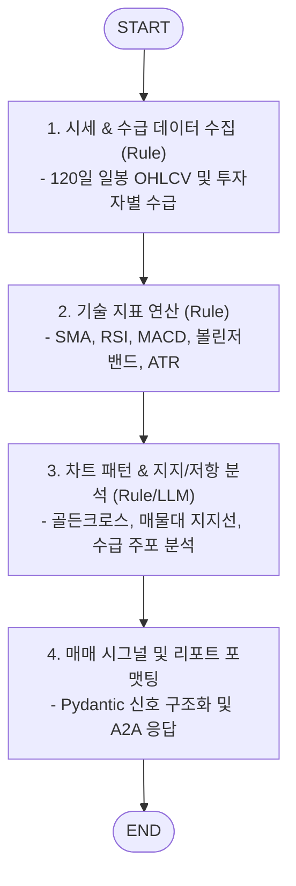

# 📈 Technical Analysis Sub-Agent (`technical_agent`)

본 문서는 캔들 차트 패턴, 이동평균선, 보조 지표 및 수급 데이터를 정량 분석하는 **Technical Analysis Sub-Agent**의 아키텍처 및 구현 가이드입니다.

---

## 1. 개요

`technical_agent`는 시세(OHLCV) 시계열 데이터와 투자자별(외인/기관/개인) 수급 동향을 바탕으로 기술적 분석 지표를 산출하고 매매 타이밍 시그널을 생성하는 전문 서브 에이전트입니다.
Pandas / TA-Lib 기반의 수치 계산과 LangGraph 상태 워크플로우를 결합하여 추세, 모멘텀, 변동성 지표를 종합하고 주요 지지/저항선 가격대를 계산합니다.
Google ADK의 `to_a2a` 유틸리티를 적용하여 표준 A2A JSON-RPC 2.0 서버로 동작합니다.

---

## 2. 주요 기능 및 특징

- **기술적 지표 정량 연산 (Rule / Pandas)**:
  - 추세 지표: SMA (20/60/120일 이동평균선), EMA, 골든크로스 / 데드크로스 감지.
  - 모멘텀 지표: RSI (14), MACD (12, 26, 9), 스토캐스틱 슬로우.
  - 변동성 & 채널: 볼린저 밴드(상/하단 밴드폭), ATR (Average True Range).
  - 거래량 분석: OBV (On Balance Volume), 거래량 급증률.
- **수급 주체별 동향 분석**:
  - 최근 5일/20일 외국인 및 기관 순매수 누적액 및 연속 매수일수 추적.
- **주요 지지선 & 저항선 산출**:
  - 매물대(Volume Profile) 및 피보나치 되돌림 기반 핵심 가격대 도출.
- **매매 시그널 생성 (Signal Generation)**:
  - `STRONG_BUY`, `BUY`, `NEUTRAL`, `SELL`, `STRONG_SELL` 5단계 정량 신호 반환.

---

## 3. LangGraph 워크플로우 구조



---

## 4. 기술 스택 및 요구사항

- **Language & Framework**: Python 3.12, FastAPI / Starlette
- **Data & Analytics**: Pandas, Numpy, TA-Lib (or pandas-ta)
- **Agent Framework**: LangGraph, Google ADK (`google-adk`), Pydantic
- **포트 및 서비스명**:
  - **Port**: `28005`
  - **Docker Service Name**: `agent_technical_server`

---

## 5. 실행 및 테스트

### 5.1. 에이전트 독립 실행
```bash
uvicorn agent_server.agents.technical_agent:app --host 0.0.0.0 --port 28005
```

### 5.2. Agent Card 확인
```bash
curl -s http://localhost:28005/.well-known/agent-card.json | jq .
```
