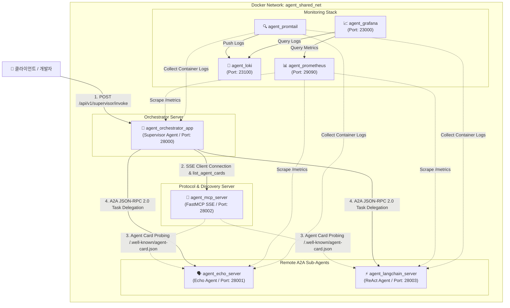

# 🏛️ Agent Ecosystem 시스템 아키텍처

본 문서는 Agent Ecosystem의 다중 에이전트 오케스트레이션 아키텍처, 프로토콜 통신 흐름, 도커 네트워크 구성 및 Observability 스택을 상세히 설명합니다.

---

## 1. 개요 (Overview)

본 시스템은 **Model Context Protocol (MCP) 기반 동적 탐색(Dynamic Discovery)**과 **Google ADK A2A (Agent-to-Agent) JSON-RPC 2.0 프로토콜**을 결합하여, 중앙 Supervisor 에이전트가 분산된 원격 에이전트(Sub-Agents)들에게 작업을 위임하고 종합 결과를 클라이언트에게 응답하는 마이크로서비스 아키텍처입니다.

---

## 2. 시스템 데이터 및 프로토콜 흐름도 (Mermaid Diagram)

---

## 3. 핵심 아키텍처 메커니즘

### 3.1. MCP 기반 동적 에이전트 탐색 (Dynamic Discovery)
- **정적 설정 제거**: Supervisor 에이전트는 Sub-Agent들의 IP나 엔드포인트를 하드코딩하지 않습니다.
- **MCP Server 연동**: Supervisor 실행 및 작업 수행 시 `agent_mcp_server` (FastMCP SSE)에 접속하여 `list_agent_cards` 도구를 호출합니다.
- **Agent Card 수집**: 각 서브 에이전트의 `/.well-known/agent-card.json` 엔드포인트를 통해 에이전트의 이름, 설명, 수신 URL, 사용 가능한 도구를 동적으로 수집하고 Supervisor의 호출 도구로 자동 전환합니다.

### 3.2. Google ADK A2A JSON-RPC 2.0 통신 프로토콜
- **표준 메시지 규격**: 에이전트 간 메세지 전달은 Google ADK A2A JSON-RPC 2.0 규격을 준수합니다.
- **Task Delegation**: Supervisor가 수신된 사용자 요청을 분석한 뒤 적절한 서브 에이전트(`echo_agent`, `langchain_agent`)에게 비동기로 메세지를 위임하고 응답 이벤트를 수집합니다.

### 3.3. Multi-Provider LLM Registry & Fallback
- **지원 프러바이더**: OpenAI (`gpt-4o-mini`), Anthropic (`claude-3-5-sonnet`), Google GenAI (`gemini-2.5-flash`).
- **Mock LLM Fallback**: `.env`에 API 키가 설정되지 않은 경우 시스템이 중단되지 않고 `FakeMessagesListChatModel` (Mock 모드)로 안전하게 fallback 작동합니다.

### 3.4. 통합 관찰 가능성 (Observability Stack)
- **Metrics**: FastAPI Prometheus Instrumentator를 통해 각 서비스의 HTTP 요청 수, 지연시간, 에러율 메트릭 수집 (`/metrics`).
- **Logs**: `shared_core.logger`를 이용한 UTF-8 지원 Structlog 구조화 로깅. `task.*` 및 `artifact.*` 컨텍스트 로그가 출력되며 Promtail을 통해 Loki에 통합 수집되어 Grafana에서 대시보드로 조회 가능합니다.

---

## 4. 네트워크 및 포트 배치표

| 컨테이너 이름 | 서비스 역할 | 호스트 포트 | 컨테이너 포트 | 네트워크 |
| :--- | :--- | :--- | :--- | :--- |
| `agent_orchestrator_app` | Supervisor API Server | `28000` | `28000` | `agent_shared_net` |
| `agent_echo_server` | Echo Sub-Agent | `28001` | `28001` | `agent_shared_net` |
| `agent_mcp_server` | FastMCP Discovery Server | `28002` | `28002` | `agent_shared_net` |
| `agent_langchain_server` | LangChain ReAct Sub-Agent | `28003` | `28003` | `agent_shared_net` |
| `agent_prometheus` | Prometheus Metrics Server | `29090` | `9090` | `agent_shared_net` |
| `agent_loki` | Loki Log Collector | `23100` | `3100` | `agent_shared_net` |
| `agent_grafana` | Grafana Visualization UI | `23000` | `3000` | `agent_shared_net` |
