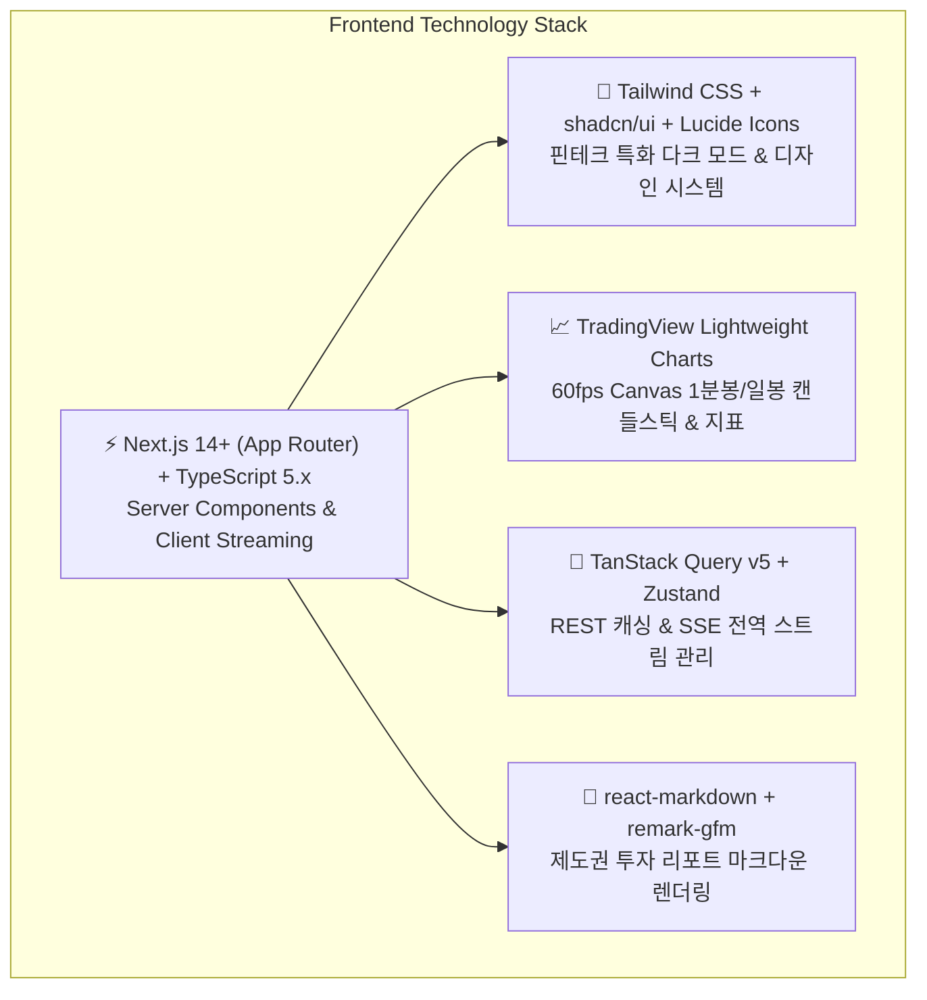

# 🎨 Frontend Architecture & Tech Stack Guide

본 문서는 **Financial Multi-Agent Ecosystem의 프론트엔드 웹 클라이언트 기술 스택 선정, 아키텍처 설계, 컴포넌트 계층 구조 및 구현 가이드**입니다.
Next.js 14+ (App Router), TypeScript, Tailwind CSS, shadcn/ui, TradingView Lightweight Charts를 기반으로 고성능 금융 대시보드를 구축하는 표준 규격을 제공합니다.

---

## 🏛️ 1. 추천 프론트엔드 기술 스택 (Tech Stack Decision)



| 계층 (Layer) | 권장 기술 (Recommended) | 선정 이유 및 핵심 기능 |
| :--- | :--- | :--- |
| **Framework** | **Next.js 14+ (App Router)** | 백엔드 SSE 스트리밍 통신 최적화, 빠른 라우팅 및 BFF(API Route) 확장성 |
| **Language** | **TypeScript 5.x** | Pydantic 스키마와 1:1 대응하는 엄격한 타입 안정성 보장 |
| **UI & Styling** | **Tailwind CSS + shadcn/ui** | 금융 배지(STRONG BUY, APPROVED), 게이지, 아코디언 컴포넌트 커스텀 |
| **Financial Chart**| **Lightweight Charts (TradingView)** | 초경량 Canvas 기반 캔들 차트, SMA(20/60/120), RSI/MACD 보조지표 렌더링 |
| **State & Stream**| **TanStack Query v5 + Zustand** | REST API 캐싱, 실시간 SSE 이벤트(`event: step_start` 등) 상태 관리 |
| **Report Viewer** | **react-markdown + remark-gfm** | Synthesizer가 생성하는 종합 리서치 보고서(표, 리스트, 볼드체) 렌더링 |

---

## 📂 2. 프론트엔드 디렉토리 구조 (Directory Structure)

```text
frontend/
├── public/                     # 정적 에셋 (로고, 종목 아이콘 등)
├── src/
│   ├── app/                    # Next.js App Router
│   │   ├── layout.tsx          # 루트 레이아웃 (테마 프로바이더, 쿼리 클라이언트)
│   │   ├── page.tsx            # 메인 대시보드 페이지
│   │   └── globals.css         # Tailwind 전역 스타일 & CSS 변수
│   │
│   ├── components/             # UI 컴포넌트
│   │   ├── common/             # 공통 UI (Header, SearchBar, ThemeToggle)
│   │   ├── dag/                # Plan-and-Execute DAG 실행 추적기 (DagTracker.tsx)
│   │   ├── chart/              # TradingView 주가 캔들스틱 차트 (StockChart.tsx)
│   │   ├── insights/           # 8대 서브 에이전트별 분석 카드 위젯
│   │   │   ├── TechnicalCard.tsx      # 기술적 지표 & 매매 시그널
│   │   │   ├── FundamentalCard.tsx    # PER/PBR/ROE 레이더 & 재무 등급
│   │   │   ├── DartDisclosureCard.tsx # DART 전자공시 & 오버행 알림
│   │   │   ├── MacroSectorCard.tsx    # 거시경제 & 섹터 상대강도
│   │   │   ├── BullBearDebateCard.tsx # 상승 vs 하락 토론 & 판사 판정
│   │   │   └── RiskGatekeeperCard.tsx # 100% Rule-Based 리스크 심의 뱃지
│   │   ├── report/             # 최종 Synthesizer 종합 리포트 뷰어 (ReportViewer.tsx)
│   │   └── ui/                 # shadcn/ui 기본 원자 컴포넌트 (button, card, badge 등)
│   │
│   ├── hooks/                  # 커스텀 훅
│   │   ├── useAgentStream.ts   # 백엔드 SSE 스트리밍 수신 및 상태 관리 훅
│   │   └── useStockPrice.ts    # 실시간 시세 폴링/웹소켓 수신 훅
│   │
│   ├── stores/                 # Zustand 전역 스토어
│   │   └── useAgentStore.ts    # 현재 선택된 종목, 실행 플랜, 단계별 결과 저장
│   │
│   ├── types/                  # TypeScript 인터페이스 정의
│   │   └── agent.ts            # 백엔드 Pydantic 스키마와 1:1 매핑되는 DTO
│   │
│   └── lib/                    # 유틸리티 (cn, formatters, api client)
│       └── utils.ts
│
├── .env.local                  # 프론트엔드 환경 변수 (NEXT_PUBLIC_API_URL 등)
├── package.json                # 의존성 패키지 정의
├── tailwind.config.ts          # Tailwind 설정
├── tsconfig.json               # TypeScript 설정
└── Dockerfile                  # 프론트엔드 도커 컨테이너 빌드 파일
```

---

## 📦 3. 패키지 의존성 명세 (`package.json`)

```json
{
  "name": "agent-ecosystem-frontend",
  "version": "1.0.0",
  "private": true,
  "scripts": {
    "dev": "next dev -p 3000",
    "build": "next build",
    "start": "next start -p 3000",
    "lint": "next lint"
  },
  "dependencies": {
    "@tanstack/react-query": "^5.28.0",
    "clsx": "^2.1.0",
    "lightweight-charts": "^4.1.3",
    "lucide-react": "^0.363.0",
    "next": "^14.2.0",
    "react": "^18.3.0",
    "react-dom": "^18.3.0",
    "react-markdown": "^9.0.1",
    "rehype-highlight": "^7.0.0",
    "remark-gfm": "^4.0.0",
    "tailwind-merge": "^2.2.2",
    "zustand": "^4.5.0"
  },
  "devDependencies": {
    "@types/node": "^20.11.0",
    "@types/react": "^18.2.0",
    "@types/react-dom": "^18.2.0",
    "autoprefixer": "^10.4.19",
    "postcss": "^8.4.38",
    "tailwindcss": "^3.4.1",
    "typescript": "^5.4.0"
  }
}
```

---

## 💻 4. 핵심 컴포넌트 구현 가이드

### 4.1. TradingView 주가 캔들 차트 (`src/components/chart/StockChart.tsx`)
```tsx
"use client";

import React, { useEffect, useRef } from "react";
import { createChart, IChartApi, ColorType } from "lightweight-charts";

interface StockChartProps {
  data: Array<{ time: string; open: number; high: number; low: number; close: number }>;
  sma20?: Array<{ time: string; value: number }>;
}

export const StockChart: React.FC<StockChartProps> = ({ data, sma20 }) => {
  const chartContainerRef = useRef<HTMLDivElement>(null);
  const chartRef = useRef<IChartApi | null>(null);

  useEffect(() => {
    if (!chartContainerRef.current) return;

    const chart = createChart(chartContainerRef.current, {
      layout: {
        background: { type: ColorType.Solid, color: "#0f172a" }, // Dark Slate
        textColor: "#94a3b8",
      },
      grid: {
        vertLines: { color: "#1e293b" },
        horzLines: { color: "#1e293b" },
      },
      width: chartContainerRef.current.clientWidth,
      height: 380,
    });

    const candleSeries = chart.addCandlestickSeries({
      upColor: "#ef4444", // 한국 증시: 상승 빨간색
      downColor: "#3b82f6", // 한국 증시: 하락 파란색
      borderVisible: false,
      wickUpColor: "#ef4444",
      wickDownColor: "#3b82f6",
    });
    candleSeries.setData(data);

    if (sma20 && sma20.length > 0) {
      const smaSeries = chart.addLineSeries({
        color: "#eab308", // Yellow 20일선
        lineWidth: 2,
      });
      smaSeries.setData(sma20);
    }

    chart.timeScale().fitContent();
    chartRef.current = chart;

    const handleResize = () => {
      if (chartContainerRef.current && chartRef.current) {
        chartRef.current.applyOptions({ width: chartContainerRef.current.clientWidth });
      }
    };
    window.addEventListener("resize", handleResize);

    return () => {
      window.removeEventListener("resize", handleResize);
      chart.remove();
    };
  }, [data, sma20]);

  return <div ref={chartContainerRef} className="w-full rounded-lg overflow-hidden border border-slate-800" />;
};
```

---

### 4.2. Plan-and-Execute DAG 단계별 실행 추적기 (`src/components/dag/DagTracker.tsx`)
```tsx
"use client";

import React from "react";
import { CheckCircle2, CircleDashed, Loader2 } from "lucide-react";
import { ExecutionPlan } from "@/types/agent";

interface DagTrackerProps {
  plan: ExecutionPlan | null;
  currentStep: number;
  completedAgents: string[];
}

export const DagTracker: React.FC<DagTrackerProps> = ({ plan, currentStep, completedAgents }) => {
  if (!plan || !plan.steps.length) return null;

  // step_id 기준 그룹화
  const groupedSteps = plan.steps.reduce((acc, step) => {
    if (!acc[step.step_id]) acc[step.step_id] = [];
    acc[step.step_id].push(step);
    return acc;
  }, {} as Record<number, typeof plan.steps>);

  const stepLabels: Record<number, string> = {
    1: "1단계: 데이터 수집 & 뉴스 정제",
    2: "2단계: 4대 영역 심층 병렬 분석",
    3: "3단계: Bull vs Bear 대립 토론",
    4: "4단계: 리스크 게이트키퍼 심의",
  };

  return (
    <div className="bg-slate-900 border border-slate-800 rounded-xl p-4 my-4">
      <div className="flex items-center justify-between mb-3">
        <h3 className="text-sm font-semibold text-slate-200">
          ⚡ Plan-and-Execute DAG 파이프라인 (종목: {plan.ticker})
        </h3>
        <span className="text-xs px-2 py-0.5 rounded bg-blue-950 text-blue-400 border border-blue-800">
          {plan.query_intent}
        </span>
      </div>

      <div className="grid grid-cols-1 md:grid-cols-4 gap-3">
        {Object.entries(groupedSteps).map(([stepIdStr, steps]) => {
          const stepId = Number(stepIdStr);
          const isCurrent = currentStep === stepId;
          const isDone = currentStep > stepId;

          return (
            <div
              key={stepId}
              className={`p-3 rounded-lg border transition-all ${
                isCurrent
                  ? "bg-blue-950/40 border-blue-500 shadow-lg shadow-blue-500/10"
                  : isDone
                  ? "bg-slate-950/60 border-slate-800 text-slate-400"
                  : "bg-slate-950/20 border-slate-900 text-slate-600"
              }`}
            >
              <div className="flex items-center gap-2 mb-2">
                {isCurrent ? (
                  <Loader2 className="w-4 h-4 text-blue-400 animate-spin" />
                ) : isDone ? (
                  <CheckCircle2 className="w-4 h-4 text-emerald-400" />
                ) : (
                  <CircleDashed className="w-4 h-4 text-slate-600" />
                )}
                <span className="text-xs font-medium">{stepLabels[stepId] || `${stepId}단계`}</span>
              </div>

              <div className="space-y-1">
                {steps.map((s) => {
                  const agentDone = completedAgents.includes(s.agent_name);
                  return (
                    <div key={s.agent_name} className="flex items-center justify-between text-[11px]">
                      <span className="font-mono text-slate-300">{s.agent_name}</span>
                      {agentDone && <span className="text-emerald-400">완료</span>}
                    </div>
                  );
                })}
              </div>
            </div>
          );
        })}
      </div>
    </div>
  );
};
```

---

### 4.3. 100% Rule-Based 리스크 심의 위젯 (`src/components/insights/RiskGatekeeperCard.tsx`)
```tsx
import React from "react";
import { ShieldCheck, ShieldAlert, AlertTriangle } from "lucide-react";

interface RiskGatekeeperProps {
  verdict: "APPROVED" | "REJECTED" | "ADJUSTED";
  approvedWeight: number;
  stopLossPrice: number;
  panicMarketFlag: boolean;
  reason: string;
}

export const RiskGatekeeperCard: React.FC<RiskGatekeeperProps> = ({
  verdict,
  approvedWeight,
  stopLossPrice,
  panicMarketFlag,
  reason,
}) => {
  const isApproved = verdict === "APPROVED";

  return (
    <div className={`p-4 rounded-xl border ${
      isApproved ? "bg-emerald-950/20 border-emerald-900/50" : "bg-rose-950/20 border-rose-900/50"
    }`}>
      <div className="flex items-center justify-between mb-3">
        <div className="flex items-center gap-2">
          {isApproved ? (
            <ShieldCheck className="w-5 h-5 text-emerald-400" />
          ) : (
            <ShieldAlert className="w-5 h-5 text-rose-400" />
          )}
          <h4 className="font-semibold text-sm text-slate-200">🛡️ 100% Rule-Based 리스크 심의</h4>
        </div>
        <span className={`px-2.5 py-0.5 rounded-full text-xs font-bold ${
          isApproved ? "bg-emerald-500/20 text-emerald-300 border border-emerald-500/30" : "bg-rose-500/20 text-rose-300 border border-rose-500/30"
        }`}>
          {verdict}
        </span>
      </div>

      <div className="grid grid-cols-2 gap-3 mb-3 text-xs">
        <div className="p-2.5 rounded-lg bg-slate-900/60 border border-slate-800">
          <span className="text-slate-400 block mb-1">승인 투자 비중 (Max 15%)</span>
          <span className="text-base font-bold text-slate-100">{(approvedWeight * 100).toFixed(1)}%</span>
        </div>
        <div className="p-2.5 rounded-lg bg-slate-900/60 border border-slate-800">
          <span className="text-slate-400 block mb-1">동적 손절선 (ATR 1.5x)</span>
          <span className="text-base font-bold text-rose-400">{stopLossPrice.toLocaleString()}원</span>
        </div>
      </div>

      {panicMarketFlag && (
        <div className="flex items-center gap-2 p-2 rounded bg-rose-950 border border-rose-800 text-rose-300 text-xs mb-2">
          <AlertTriangle className="w-4 h-4 flex-shrink-0" />
          <span>⚠️ 코스피 -3.0% 이상 급락장 감지: 신규 매수 전면 차단</span>
        </div>
      )}

      <p className="text-xs text-slate-400">{reason}</p>
    </div>
  );
};
```

---

## 🐳 5. Docker 컨테이너 배포 가이드 (`frontend/Dockerfile`)

```dockerfile
# ── Build Stage ──
FROM node:20-alpine AS builder
WORKDIR /app
COPY package.json package-lock.json* ./
RUN npm ci
COPY . .
RUN npm run build

# ── Production Stage ──
FROM node:20-alpine AS runner
WORKDIR /app
ENV NODE_ENV=production
COPY --from=builder /app/public ./public
COPY --from=builder /app/.next/standalone ./
COPY --from=builder /app/.next/static ./.next/static

EXPOSE 3000
ENV PORT=3000
CMD ["node", "server.js"]
```

---

## 📚 6. 문서 연동 및 하네스 링크
- **[🎨 프론트엔드 연동 하네스 상세 명세 (frontend_harness.md)](../harness/frontend_harness.md)**
- **[🧪 통합 테스트 & 하네스 엔지니어링 가이드 (harness/README.md)](../harness/README.md)**
- **[🏛️ 전체 시스템 아키텍처 (architecture.md)](../architecture.md)**
