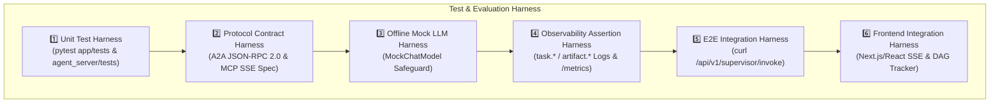

# 🧪 Test & Evaluation Harness Engineering Guide

본 문서는 Agent Ecosystem의 **하네스 엔지니어링(Harness Engineering) 관점의 검증, 테스트 및 평가 프레임워크 명세서**입니다.
다중 에이전트 오케스트레이션 시스템의 신뢰성, 계약(Contract) 준수 여부, 오프라인 결정론적 테스트, 관찰 가능성 및 **프론트엔드 연동 하네스**를 자동 검증하기 위한 가이드를 제공합니다.

> 🎨 **프론트엔드(Next.js/React) 전용 연동 및 UI 개발 하네스 가이드는 [docs/harness/frontend_harness.md](frontend_harness.md)에서 확인하실 수 있습니다.**

---

## 1. 하네스 엔지니어링 아키텍처 (Harness Architecture)

본 시스템의 검증 하네스는 6단계 레이어로 구성됩니다.



---

## 2. 레이어별 검증 명세 (Harness Layers Spec)

### 2.1. Offline Mock LLM Harness (오프라인 검증 하네스)
- **목적**: 외부 LLM (OpenAI, Anthropic, Google) API 키나 네트워크 연결 없이도 하네스가 독립 구동되는 오프라인 샌드박스 검증.
- **메커니즘**:
  - `.env` 키 미설정 시 `LLMRegistry`가 `MockChatModel` 인스턴스를 자동으로 생성.
  - `responses=[AIMessage(content="[Mock] Response")]` 형태의 미리 정의된 결정론적 시퀀스로 에이전트 제어 로직 검증.
- **Pytest 구동 예시**:
  ```python
  fake_llm = FakeMessagesListChatModel(responses=[AIMessage(content="Mock Test Output")])
  supervisor = SupervisorAgent(llm=fake_llm, remote_agents={})
  res = await supervisor.ainvoke({"message": "Test Message"})
  assert res["output"] == "Mock Test Output"
  ```

---

### 2.2. Protocol Contract Harness (계약 검증 하네스)

#### A. A2A (Agent-to-Agent) JSON-RPC 2.0 Contract
- **검증 표준**: Google ADK `to_a2a` 어댑터가 노출하는 REST 및 JSON-RPC 규격.
- **필수 계약 항목**:
  1. `GET /.well-known/agent-card.json` -> HTTP 200 OK, JSON 객체 반환 (`name`, `description`, `url`).
  2. `POST /` -> JSON-RPC 2.0 `SendMessage` 처리 및 `event` 객체 응답.

#### B. MCP (Model Context Protocol) SSE Contract
- **검증 표준**: FastMCP SSE 전송 규격 및 `list_agent_cards` 도구 파싱.
- **필수 계약 항목**:
  1. `GET /sse` -> SSE Server-Sent Event 스트림 연결.
  2. `list_agent_cards` 실행 -> 서브 에이전트 Card 메타데이터 리스트 수집.

---

### 2.3. Observability Assertion Harness (로그/메트릭 하네스)
- **로그 명명 표준 (Log Assertion)**:
  - 태스크 실행 로그: `task.<agent_name>.<event>` (예: `task.data_processing_agent.received_message`)
  - 결과 아티팩트 로그: `artifact.<agent_name>.<event>` (예: `artifact.fundamental_agent.valuation_calculated`)
- **메트릭 엔드포인트 수집 (Metric Assertion)**:
  - 모든 서비스의 `GET /metrics`가 HTTP 200 OK 및 Prometheus 텍스트 메트릭을 반환해야 함.

---

### 2.4. Frontend Integration Harness (프론트엔드 연동 하네스)
- **상세 문서**: [frontend_harness.md](frontend_harness.md)
- **주요 기능**:
  - `POST /api/v1/supervisor/invoke` 동기 호출 및 `POST /api/v1/supervisor/stream` SSE 실시간 스트리밍
  - DAG 실행 단계 추적기(Plan Tracker), 인터랙티브 주가 차트, Bull vs Bear 토론 위젯, 100% Rule-Based 리스크 심의 게이지
  - Mock Fixture 및 `useAgentStream` 커스텀 훅 지원

---

## 3. 하네스 자동화 실행 명령어 (Automated Harness Execution)

### 3.1. 단위 및 통합 테스트 실행 (20/20 Passed)
```bash
# Orchestrator App 테스트 (10개)
cd app && uv run pytest

# 8대 Sub-Agents & Worker 테스트 (10개)
cd agent_server && uv run pytest
```

### 3.2. A2A & MCP 프로토콜 계약 검증 (`curl` 하네스 스크립트)

#### 1) Sub-Agent Card 검증 (8대 서브 에이전트: 28001, 28003~28009)
```bash
for port in 28001 28003 28004 28005 28006 28007 28008 28009; do
  echo "Testing Agent Card on Port :$port"
  curl -s http://localhost:${port}/.well-known/agent-card.json | jq .
done
```

#### 2) Supervisor End-to-End 하네스 검증
```bash
curl -X POST http://localhost:28000/api/v1/supervisor/invoke \
  -H "Content-Type: application/json" \
  -d '{"message": "삼성전자(005930)에 대한 종합 펀더멘털 및 기술적 분석과 리스크 심의를 수행해줘"}' | jq .
```

#### 3) Monitoring & Metrics 검증
```bash
for port in 28000 28001 28003 28004 28005 28006 28007 28008 28009; do
  curl -s http://localhost:${port}/metrics | grep http_requests
done
```

---

## 4. 하네스 엔지니어링 체크리스트 (Harness Checklist)

- [x] **Zero Dependency Execution**: API 키가 없을 때 Mock LLM으로 자동 세이프가드 전환되는가?
- [x] **Agent Card Discovery**: MCP Server가 모든 원격 에이전트의 `/.well-known/agent-card.json`을 프로빙할 수 있는가?
- [x] **A2A Protocol Compliance**: 서브 에이전트들이 `to_a2a` 래퍼를 통해 JSON-RPC 2.0 표준 이벤트를 반환하는가?
- [x] **Log & Metric Tracing**: 모든 주요 에이전트 이벤트가 `task.*` 및 `artifact.*` 형식을 준수하고 `/metrics`가 노출되는가?
- [x] **Frontend Contract Ready**: 프론트엔드가 실시간 SSE 스트리밍과 DAG 단계 추적을 개발할 수 있는 하네스 가이드가 구비되었는가?
