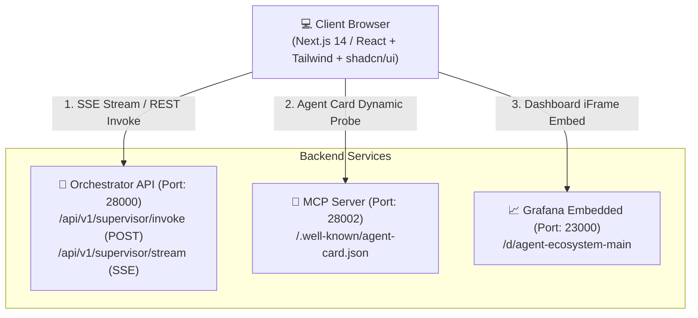

# 🎨 Frontend Engineering & Integration Harness Guide

본 문서는 **Financial Multi-Agent Ecosystem의 프론트엔드 UI/UX 개발, 연동 및 테스트를 위한 프론트엔드 엔지니어링 하네스 명세서**입니다.
Next.js/React 기반의 웹 클라이언트를 독립적으로 구축하고, 백엔드의 **Plan-and-Execute DAG 파이프라인**, **Server-Sent Events (SSE) 실시간 스트리밍**, **8대 서브 에이전트 분석 결과**를 시각화하기 위한 표준 규격을 제공합니다.

---

## 🏛️ 1. 프론트엔드 연동 아키텍처 (Frontend Architecture)



---

## 🔌 2. 백엔드 API 계약 명세 (API Contract Specification)

프론트엔드는 `http://localhost:28000` (Orchestrator App)과 통신합니다.

### 2.1. 종합 분석 단일 호출 (`POST /api/v1/supervisor/invoke`)
- **URL**: `http://localhost:28000/api/v1/supervisor/invoke`
- **Method**: `POST`
- **Request Headers**: `Content-Type: application/json`
- **Request Body**:
  ```json
  {
    "message": "삼성전자(005930) 종합 분석 및 투자 심의해줘",
    "session_id": "optional-uuid-v4"
  }
  ```
- **Response Schema (`InvokeResponse`)**:
  ```typescript
  export interface PlanStep {
    step_id: number;
    agent_name: string;
    task_prompt: string;
  }

  export interface ExecutionPlan {
    ticker: string;
    query_intent: "NEWS_ONLY" | "CHART_ONLY" | "FULL_ANALYSIS";
    steps: PlanStep[];
  }

  export interface InvokeResponse {
    status: "success" | "error";
    plan: ExecutionPlan;
    step_results: {
      data_processing_agent?: {
        ticker: string;
        technical_metrics: {
          current_price: number;
          sma_20: number;
          sma_60: number;
          sma_120: number;
          rsi_14: number;
        };
        news_analysis: {
          sentiment: "POSITIVE" | "NEUTRAL" | "NEGATIVE";
          sentiment_score: number;
          key_keywords: string[];
        };
      };
      web_search_agent?: {
        query: string;
        summary: string;
        sources: Array<{ title: string; url: string; snippet: string }>;
      };
      fundamental_agent?: {
        ticker: string;
        valuation_metrics: {
          per: number;
          pbr: number;
          roe: number;
          grade: "S" | "A" | "B" | "C" | "D";
          target_price_range: [number, number];
        };
      };
      technical_agent?: {
        ticker: string;
        signal_result: {
          signal: "STRONG_BUY" | "BUY" | "NEUTRAL" | "SELL" | "STRONG_SELL";
          support_levels: number[];
          resistance_levels: number[];
          atr_14: number;
        };
      };
      dart_disclosure_agent?: {
        ticker: string;
        disclosure_analysis: {
          recent_disclosures_count: number;
          dilution_risk: "HIGH" | "MEDIUM" | "LOW";
          overhang_warning: boolean;
        };
      };
      macro_sector_agent?: {
        ticker: string;
        sector_data: {
          sector_name: string;
          relative_strength_rank: number;
          macro_score: number;
        };
      };
      bull_bear_debate_agent?: {
        ticker: string;
        judge_verdict: {
          decision: "STRONG_BUY" | "BUY" | "HOLD" | "SELL" | "STRONG_SELL";
          confidence_score: number;
          bull_summary: string;
          bear_summary: string;
        };
      };
      risk_management_agent?: {
        ticker: string;
        verdict: "APPROVED" | "REJECTED" | "ADJUSTED";
        approved_weight: number;      // 최대 0.15 (15%)
        stop_loss_price: number;     // ATR 기반 동적 손절가
        panic_market_flag: boolean;  // 코스피 -3% 급락 시 True
        reason: string;
      };
    };
    output: string; // 마크다운 서식의 최종 종합 리포트
    session_id?: string;
  }
  ```

---

### 2.2. 실시간 단계별 스트리밍 (`POST /api/v1/supervisor/stream`)
- **URL**: `http://localhost:28000/api/v1/supervisor/stream`
- **Method**: `POST`
- **Headers**: `Accept: text/event-stream`
- **SSE 이벤트 프로토콜**:
  ```text
  event: plan
  data: {"ticker": "005930", "query_intent": "FULL_ANALYSIS", "steps": [...]}

  event: step_start
  data: {"step_id": 1, "agent_name": "data_processing_agent"}

  event: step_complete
  data: {"step_id": 1, "agent_name": "data_processing_agent", "result": {...}}

  event: final_report
  data: {"output": "## 종합 투자 의견서...", "approved_weight": 0.12, "stop_loss_price": 72500}

  event: done
  data: {"status": "finished"}
  ```

---

## 🧩 3. 프론트엔드 UI 컴포넌트 설계 가이드

프론트엔드 UI는 다음과 같은 6개 핵심 위젯으로 분할하여 개발하는 것을 권장합니다.

```text
┌──────────────────────────────────────────────────────────────────────────────────┐
│  🔍 [Header] 종목코드/명 검색창 (005930)   🟢 시스템 상태: 8 에이전트 정상 가동     │
├──────────────────────────────────────────────────────────────────────────────────┤
│  ⚡ [Plan DAG Tracker] 실행 단계 타임라인                                          │
│  [Step 1: 수집 (Data / Web)] ➡️ [Step 2: 분석 (4개 병렬)] ➡️ [Step 3: 토론] ➡️ [Step 4: 리스크]│
├────────────────────────────────────────┬─────────────────────────────────────────┤
│  📈 [Technical & Chart Widget]         │  📑 [Fundamental & Valuation Radar]     │
│  - 1분봉/일봉 TradingView 캔들스틱      │  - PER: 12.4 / PBR: 1.2 / ROE: 14.5%   │
│  - SMA 20/60/120 & RSI / MACD          │  - 재무 등급: [ A+ ]                     │
│  - 매매신호: [ 🟢 STRONG BUY ]          │  - 목표가 밴드: 82,000 ~ 95,000원       │
├────────────────────────────────────────┼─────────────────────────────────────────┤
│  🐂🐻 [Bull vs Bear Debate & Judge]   │  🛡️ [Risk Management & Gatekeeper]       │
│  - 상승론: "반도체 HBM 수요 폭발"       │  - 심의 결과: [ ✅ APPROVED ]            │
│  - 하락론: "파운드리 수율 불안정"       │  - 포트폴리오 승인 비중: [ 12.5% / Max 15% ]│
│  - 판사 판정: 85점 (적극 매수)         │  - 동적 손절선: [ 72,750원 (ATR -1.5x) ] │
├────────────────────────────────────────┴─────────────────────────────────────────┤
│  📜 [Markdown Final Synthesis Report] 제도권 리서치 보고서 뷰어                    │
└──────────────────────────────────────────────────────────────────────────────────┘
```

---

## 🛠️ 4. 프론트엔드 Mock 하네스 셋업 (Offline Mocking)

백엔드 서버 없이 프론트엔드 화면과 상태 관리를 독립적으로 개발/테스트하기 위한 Mock Fixture 및 훅 구현 예시입니다.

### 4.1. Mock Data Fixture (`mockData.ts`)
```typescript
import { InvokeResponse } from "./types";

export const MOCK_SAMSUNG_RESPONSE: InvokeResponse = {
  status: "success",
  plan: {
    ticker: "005930",
    query_intent: "FULL_ANALYSIS",
    steps: [
      { step_id: 1, agent_name: "data_processing_agent", task_prompt: "시세 및 뉴스 수집" },
      { step_id: 1, agent_name: "web_search_agent", task_prompt: "최신 웹 뉴스 검색" },
      { step_id: 2, agent_name: "fundamental_agent", task_prompt: "재무제표 3표 분석" },
      { step_id: 2, agent_name: "technical_agent", task_prompt: "차트 및 보조지표 분석" },
      { step_id: 2, agent_name: "dart_disclosure_agent", task_prompt: "DART 전자공시 분석" },
      { step_id: 2, agent_name: "macro_sector_agent", task_prompt: "거시경제 지표 분석" },
      { step_id: 3, agent_name: "bull_bear_debate_agent", task_prompt: "상승 vs 하락 토론" },
      { step_id: 4, agent_name: "risk_management_agent", task_prompt: "리스크 게이트키퍼 심의" }
    ]
  },
  step_results: {
    data_processing_agent: {
      ticker: "005930",
      technical_metrics: { current_price: 75000, sma_20: 74200, sma_60: 73000, sma_120: 71000, rsi_14: 58.4 },
      news_analysis: { sentiment: "POSITIVE", sentiment_score: 0.82, key_keywords: ["HBM3E", "엔비디아", "영업이익"] }
    },
    fundamental_agent: {
      ticker: "005930",
      valuation_metrics: { per: 13.2, pbr: 1.25, roe: 12.8, grade: "A", target_price_range: [85000, 95000] }
    },
    technical_agent: {
      ticker: "005930",
      signal_result: { signal: "BUY", support_levels: [73500, 72000], resistance_levels: [78000, 81000], atr_14: 1500 }
    },
    risk_management_agent: {
      ticker: "005930",
      verdict: "APPROVED",
      approved_weight: 0.12,
      stop_loss_price: 72750,
      panic_market_flag: false,
      reason: "단일 종목 한도(15%) 준수 및 정상 변동성 확인"
    }
  },
  output: "# [005930] 삼성전자 종합 투자 분석 리포트\n\n### 1. 종합 투자의견: BUY (매수)\n- **펀더멘털**: 밸류에이션 등급 A, HBM 납품 확대로 2분기 영업이익 개선 전망\n- **기술적 분석**: 20일선 지지 반등 및 골든크로스 형성\n- **리스크 관리**: 포트폴리오 권장 비중 12%, 손절가 72,750원 설정"
};
```

---

### 4.2. SSE 스트리밍 커스텀 훅 (`useAgentStream.ts`)
```typescript
import { useState, useCallback } from "react";
import { ExecutionPlan, InvokeResponse } from "./types";

export function useAgentStream() {
  const [isStreaming, setIsStreaming] = useState(false);
  const [plan, setPlan] = useState<ExecutionPlan | null>(null);
  const [currentStep, setCurrentStep] = useState<number>(0);
  const [completedSteps, setCompletedSteps] = useState<Record<string, any>>({});
  const [finalReport, setFinalReport] = useState<string>("");

  const startStream = useCallback(async (query: string) => {
    setIsStreaming(true);
    setCompletedSteps({});
    setFinalReport("");

    try {
      const response = await fetch("http://localhost:28000/api/v1/supervisor/stream", {
        method: "POST",
        headers: { "Content-Type": "application/json" },
        body: JSON.stringify({ message: query }),
      });

      if (!response.body) throw new Error("No response body");

      const reader = response.body.getReader();
      const decoder = new TextDecoder();
      let buffer = "";

      while (true) {
        const { done, value } = await reader.read();
        if (done) break;

        buffer += decoder.decode(value, { stream: true });
        const lines = buffer.split("\n\n");
        buffer = lines.pop() || "";

        for (const line of lines) {
          if (line.startsWith("event: plan")) {
            const dataStr = line.split("data: ")[1];
            setPlan(JSON.parse(dataStr));
          } else if (line.startsWith("event: step_start")) {
            const dataStr = line.split("data: ")[1];
            const data = JSON.parse(dataStr);
            setCurrentStep(data.step_id);
          } else if (line.startsWith("event: step_complete")) {
            const dataStr = line.split("data: ")[1];
            const data = JSON.parse(dataStr);
            setCompletedSteps((prev) => ({ ...prev, [data.agent_name]: data.result }));
          } else if (line.startsWith("event: final_report")) {
            const dataStr = line.split("data: ")[1];
            const data = JSON.parse(dataStr);
            setFinalReport(data.output);
          }
        }
      }
    } catch (err) {
      console.error("Streaming error:", err);
    } finally {
      setIsStreaming(false);
    }
  }, []);

  return { isStreaming, plan, currentStep, completedSteps, finalReport, startStream };
}
```

---

## 📊 5. Grafana 모니터링 iFrame 임베딩 규격

프론트엔드 관리자 뷰에 시스템 모니터링 패널을 임베딩할 경우 다음 URL 형식을 사용합니다:

- **통합 대시보드 URL**:
  `http://localhost:23000/d/agent-ecosystem-main/financial-multi-agent-ecosystem-dashboard?kiosk=tv`
- **단일 패널 임베딩 (예: Active Agents KPI)**:
  `http://localhost:23000/d-solo/agent-ecosystem-main/financial-multi-agent-ecosystem-dashboard?panelId=1&theme=dark`

---

## 🧪 6. 프론트엔드 하네스 검증 체크리스트

- [ ] **TypeScript 타입 일치성**: `InvokeResponse` 및 `ExecutionPlan` 인터페이스가 백엔드 Pydantic 스키마와 완벽히 호환되는가?
- [ ] **DAG 시각화**: `steps` 배열의 `step_id` 순서에 따라 병렬 실행 노드(동일 step_id)와 순차 실행 노드가 분기 렌더링되는가?
- [ ] **스트리밍 끊김 복구**: 네트워크 단절 시 SSE 자동 재연결 및 상태 롤백 처리가 구현되어 있는가?
- [ ] **모바일/반응형 뷰**: 차트 및 토론 위젯이 모바일 해상도(375px~)에서도 가로 스크롤 없이 가독성을 유지하는가?
- [ ] **마크다운 렌더링**: Synthesizer 리포트의 표, 글머리 기호, 볼드체 및 수식이 정상적으로 파싱되는가?
