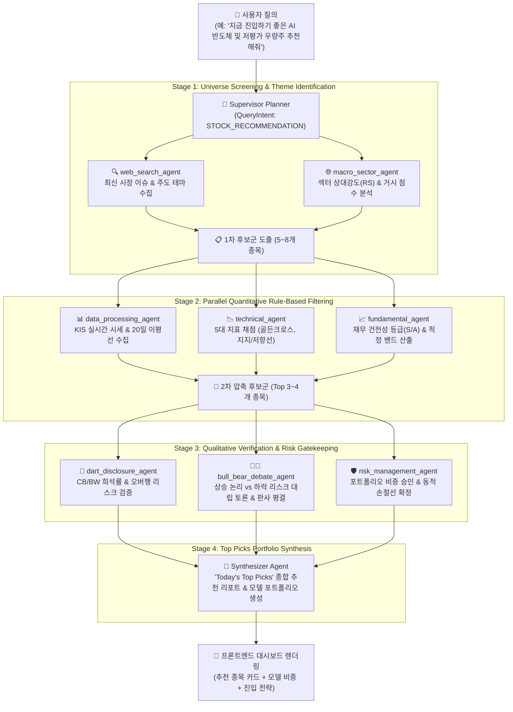

# 🎯 멀티에이전트 기반 AI 종목 추천 워크플로우 설계서 (Stock Recommendation Plan Spec)

본 문서는 기존 **Plan-and-Execute 기반 중앙 Supervisor 오케스트레이터**와 **8대 분산 금융 서브 에이전트**를 활용하여, 사용자의 질의나 투자 테마에 따라 최적의 유망 종목을 발굴·검증·추천하는 **종목 추천(Stock Recommendation & Screening) 파이프라인**의 아키텍처 및 DAG 실행 계획을 정의합니다.

---

## 1. 📌 개요 및 핵심 목표

기존 시스템이 **"단일 종목(Single Ticker)에 대한 8대 관점 심층 분석"**이었다면, 본 추천 워크플로우는 **"매크로 트렌드 ➡️ 후보군 스크리닝 ➡️ 8대 에이전트 정량/정성 검증 ➡️ Top Picks 모델 포트폴리오 추천"**으로 확장됩니다.

### 💡 핵심 차별점
1. **단순 정적 순위 나열 방지**: 단순 거래량 순위가 아닌 **8대 서브에이전트의 다각도 검증(재무, 차트, 공시, 매크로, 토론, 리스크 심의)**을 거친 검증된 종목만 추천.
2. **100% Rule-Based 가격 밴드 일치**: 추천 종목마다 실시간 현재가($P_0$) 기반의 **적정 목표가 밴드, 1/2차 분할 매수가, 필수 동적 손절선, 승인 비중**을 함께 제공.
3. **투자 성향별 맞춤형 테마 지원**:
   - `성장/모멘텀형`: AI 인프라, 차세대 반도체, 로봇, 2차전지 턴어라운드
   - `가치/안정형`: 저PBR 밸류업, 고배당, 현금흐름(FCF) 우량주
   - `수급/단기형`: 외국인·기관 5일 연속 순매수, 이평선 정배열 골든크로스 종목

---

## 2. 🏗️ Plan-and-Execute DAG 워크플로우 (4-Stage Pipeline)



---

## 3. 📋 단계별 세부 실행 계획 (Execution Plan Specification)

### Stage 1: 테마 분석 및 1차 유니버스 발굴 (Theme & Universe)
- **목적**: 거시경제 지표 및 시장 뉴스에서 현재 가장 강력한 모멘텀을 가진 섹터의 후보 종목 5~8개 도출.
- **수행 에이전트**:
  - `macro_sector_agent`: 원/달러 환율, 미 금리, 섹터 상대강도(RS > 1.15) 상위 업종 선정.
  - `web_search_agent`: 최근 7일간 실적 전망 상향 및 수급 유입 관련 증권사 리서치 검색.

### Stage 2: 정량적 Rule-Based 필터링 (Quantitative Filter)
- **목적**: 100% Rule-Based 평가 모델을 통해 부실 종목을 기계적으로 걸러내고 상위 3~4개 압축.
- **수행 에이전트 및 필터링 기준**:
  - `fundamental_agent`: 재무 등급 **S등급 또는 A등급** ($ROE \ge 10\%$, 부채비율 $\le 150\%$) 종목만 통과.
  - `technical_agent`: 5단계 시그널 점수 **3점 이상 (`BUY` / `STRONG_BUY`)** 및 이평선 정배열 종목 선정.
  - `data_processing_agent`: KIS 실시간 시세 $P_0$ 및 20일 일평균 거래대금 50억 원 이상 유동성 검증.

### Stage 3: 정성적 심의 및 리스크 통제 (Qualitative & Risk Gatekeeping)
- **목적**: 오버행(잠재 매물)과 매크로 역풍을 검증하고, 개별 종목의 목표가/손절가를 확정.
- **수행 에이전트**:
  - `dart_disclosure_agent`: 미상환 전환사채(CB), 신주인수권부사채(BW), 대주주 매도 공시가 있는 종목 탈락 (`overhang_risk == LOW`인 종목만 승인).
  - `bull_bear_debate_agent`: LLM 기반 Bull vs Bear 토론을 거쳐 판사 확신도 **80% 이상**인 종목 최종 선정.
  - `risk_management_agent`: 실시간 현재가($P_0$) 대비 필수 동적 손절가($P_0 - ATR \times 1.5$) 및 포트폴리오 편입 비중(단일 종목 최대 15%) 승인.

### Stage 4: 최종 추천 포트폴리오 조립 (Top Picks Synthesis)
- **목적**: Top 3 종목에 대한 종합 리포트 및 모델 포트폴리오 비중 가이드라인 작성.
- **출력 결과 (Executive Portfolio Structure)**:
  - **종목 1 (최우선 추천주)**: 비중 15.0%, 적정 목표가, 1/2차 분할 매수가, 손절가
  - **종목 2 (차선 추천주)**: 비중 10.0%, 적정 목표가, 1/2차 분할 매수가, 손절가
  - **종목 3 (헤지/밸류형 추천주)**: 비중 10.0%, 적정 목표가, 1/2차 분할 매수가, 손절가
  - **현금 비중**: 65.0% (시장 변동성 대비 현금 완충 확보)

---

## 4. 📦 JSON 응답 스키마 (Recommendation Response Schema)

```json
{
  "intent": "STOCK_RECOMMENDATION",
  "theme": "AI 반도체 및 실적 턴어라운드 우량주",
  "recommended_stocks": [
    {
      "rank": 1,
      "ticker": "005930",
      "name": "삼성전자",
      "current_price": 262000,
      "opinion": "STRONG_BUY",
      "target_price_range": [288200, 327500],
      "upside_percent": 25.0,
      "buy_levels": [254100, 246300],
      "stop_loss_price": 243700,
      "approved_weight": 0.15,
      "financial_grade": "A 등급",
      "key_catalyst": "HBM 공급 확대 및 20일선 정배열 지지 수급 유입"
    },
    {
      "rank": 2,
      "ticker": "000660",
      "name": "SK하이닉스",
      "current_price": 195000,
      "opinion": "STRONG_BUY",
      "target_price_range": [224000, 243000],
      "upside_percent": 24.6,
      "buy_levels": [189000, 183000],
      "stop_loss_price": 181300,
      "approved_weight": 0.10,
      "financial_grade": "S 등급",
      "key_catalyst": "HBM3E 글로벌 독점 공급 지위 및 영업이익률 극대화"
    }
  ],
  "portfolio_summary": {
    "total_equity_weight": 0.25,
    "cash_reserve_weight": 0.75,
    "expected_return": "+24.8%",
    "risk_level": "MODERATE"
  }
}
```

---

## 5. 🖥️ 프론트엔드 UI/UX 확장 제안

1. **대시보드 상단 퀵 테마 추천 칩(Quick Preset Chips)**:
   - `🔥 오늘의 AI 반도체 Top Picks`
   - `💎 저PBR 밸류업 고배당 추천주`
   - `🚀 외인·기관 쌍끌이 순매수 급등주`
2. **추천 종목 비교 카드 (Top Picks Comparison Card)**:
   - 1위, 2위, 3위 종목을 한눈에 비교할 수 있는 카드 덱 UI.
   - 각 카드 클릭 시 즉시 해당 종목의 8대 서브에이전트 상세 DAG 대시보드로 원클릭 전환.
3. **모델 포트폴리오 비중 도넛 차트 (Asset Allocation View)**:
   - 승인된 종목별 비중(예: 삼성전자 15%, SK하이닉스 10%, 현금 75%)을 시각화.
